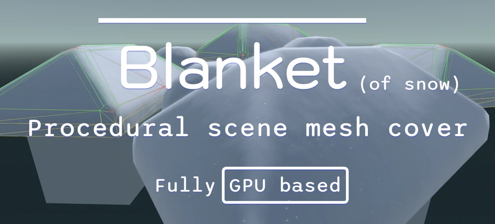
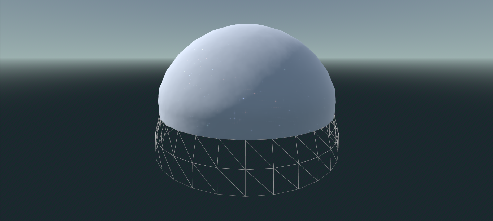

## Blanket

Procedural surface cover for Godot 4.

Lay down a layer of geometry on top of all upright surfaces in your scene.

This addon can be used to generate a blanket of snow 🏔️, mounds of dirt, or piles of autumn leaves 🍂.

Eliminate the need to modify your meshes individually - uniform effects should happen automatically!

## Features

- Customizable & smoothly animated height/depth
- Customizable upward angle
- Easy scene-wide control via main node
- Individual mesh targeting/overrides
- Easy exclusion by group

## How it Works

Everything runs on the GPU through compute shaders. **No GDExtension needed**.

Meshes are checked for upward faces. The placement of the Blanket node controls which meshes are eligible - only siblings - place directly under scene root to cover the whole scene.

Upward faces are identified, extruded and bevelled through a handful of compute dispatches, no mesh data copied back to the CPU. This happens as a one-time bake at initialization.

The resultant generated geometry is inserted as an additional surface on the same mesh. Then textured via a `ShaderMaterial`.

Depth can be animated at runtime cheaply without a rebake.

Your meshes are safe - never modified.

## Under the Hood

This addon demonstrates advanced GLSL use in Godot. Lots to be excited about.

- **Beautiful compute shaders**
  - All of your meshes processed in parallel
  - Same work would not be feasible on the CPU
- **Logical split between "bake" and "update" stages**
  - No unnecessary work done at runtime
- **Indirect dispatching of each compute pass**
  - No GPU-CPU roundtrip
  - Use case: Pass `a` determines that there's `x` number of verts, writes dispatch size for Pass `b`, which then only concerns itself with verts `x`
- **Smart workgroup layouts where possible**
  - Work distributed logically across `xyz` compute axes for better code readability
  - Workgroup sizes tailored to maximize wavefront occupancy (GPU utilization)
- **Specialization constants**
  - Some params don't change, hence can be rolled into bytecode at compile-time for efficiency
- **Direct GPU access of mesh vertex/index/attribute buffers**
- **The little known [shader versions](addons/blanket/shaders.gd#L27) in Godot**
  - Facilitates switching between half-precision and full-precision mesh buffers without code clutter
  - Small meshes with index buffers under 65k indices get 16-bit addressing in Godot
- GLSL extensions
  - [GL_EXT_scalar_block_layout](https://github.com/KhronosGroup/GLSL/blob/main/extensions/ext/GL_EXT_scalar_block_layout.txt)
  - [GL_EXT_shader_explicit_arithmetic_types](https://github.com/KhronosGroup/GLSL/blob/main/extensions/ext/GL_EXT_shader_explicit_arithmetic_types.txt)
  - [GL_EXT_shader_atomic_float](https://github.com/KhronosGroup/GLSL/blob/main/extensions/ext/GLSL_EXT_shader_atomic_float.txt)

## Requirements

- Godot 4.8 - needs [mesh buffer RIDs](https://github.com/godotengine/godot/pull/118973)
- Forward+ or Mobile renderer - Compatibility has no compute support
- Desktop recommended; mobile GPU compute may or may not work
- Meshes should be `ArrayMesh` with valid normals

## Usage

Download via Godot Asset Store or download the zip and manually copy the `addons/blanket/` folder to your project. Enable addon via Project -> Project Settings -> Addons. If you see errors, restart editor to ensure the `BlanketShaders` global is loaded.

Add a `Blanket` node as a sibling of whatever you want covered. Likewise, place directly under scene root like you would `WorldEnvironment` if you want everything covered.

To skip a mesh, assign it the `blanket_exclude` group. In case of imported meshes, any parent with this group works too.

For per-mesh control, add a `BlanketInstance` directly under a `MeshInstance3D`. Hand-placed instances are left alone - not overriden.

> [!NOTE]
> This addon is published under the MIT [license](LICENSE), so you're free to use it however you please - as long as the copyright is retained in your project code.
>
> A mention in your credits would help me make more cool stuff though.

## Support

Is this addon valuable to you? It took some real sweat and tears to make.

## Acknowledgements

- Thanks to [@Bonkahe](https://github.com/Bonkahe) for compute shader inspiration in [SunshineClouds](https://github.com/Bonkahe/SunshineClouds2).
